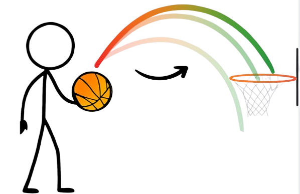

# Proyecto: Platformer - "Basketball fever"

## 1. Integrantes del Equipo
- Bahamonde, Franco
- Flores, Judith
- Musso, Miguel
- Parisi, Franco

## 2. Dominio y Alcance del Sistema

### Descripción del Problema
Se busca desarrollar una aplicación de escritorio del clasico Juego de plataformas. El jugador toma el lugar de un basquetbolista inmerso en un mundo de fantasía ambientado con la tematica de dicho deporte. En cada uno de los tres niveles se deberá avanzar verticalmente por un mapa extenso (diferenciado en escenarios), atravesando distintos obstaculos y enemigos hasta llegar a la meta final. 

### Objetivo del Sistema
El sistema será un juego funcional y extensible que permitirá al jugador experimentar las mecánicas básicas del género. El diseño debe ser escalable para facilitar la adición de nuevos tipos de enemigos, puzzles, personajes o mapas en el futuro, aplicando rigurosamente los conceptos del paradigma orientado a objetos. 

### Funcionalidades Principales (Features)

- **Sistema de progresión de dificultad**
    - Los enemigos incrementan sus atributos a medida que se avance de nivel.
    - Los obstaculos aumentan progresivamente a medida que se avance en el juego.

- **Mecánicas de Juego**
    - El jugador empieza con 0 monedas iniciales, las cuales tendra que ir recolectando entre niveles, debiendo recolectar una cantidad de monedas determinada para poder avanzar al siguiente nivel.

    - Para recolectar una moneda, el jugador deberá meter una pelota en el aro, lo cual se verá obstaculizado por la aparición de enemigos, si lo logra, avanza al siguiente escenario hasta llegar al final del nivel.
    

    - El puntaje del jugador se calculará en función del tiempo en el que completa el nivel y enemigos derrotados.

- **Sistema de combate**
    - El jugador tiene como arma principal una pelota de basquet, la cual arroja a los enemigos para derrotarlos, la pelota puede lanzarse en cualquier dirección.
    - Si el enemigo esta lo suficientemente cerca el jugador podra combatir cuerpo a cuerpo.

- **Interfaz Gráfica (IGU):**
    - Contador de tiempo
    - Vidas
    - Puntaje
    - Monedas recogidas / monedas totales

## 4. Stack Tecnológico
- **Lenguaje:** Java 25
- **IDE:** Visual Studio Code
- **Base de Datos:** ---
- **Framework de IGU:** ---
- **Control de Versiones:** Git y GitHub Classroom
